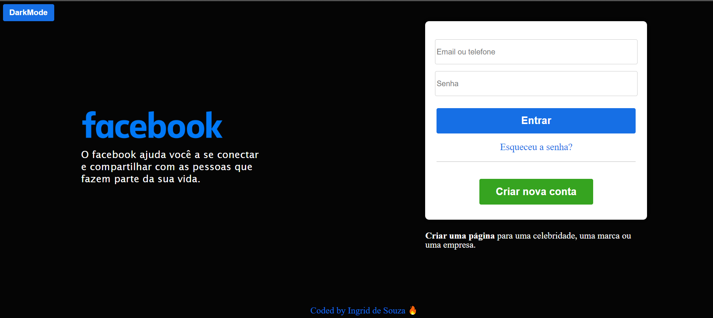

# Página de Login do Facebook

Clone da página inicial do facebook, com botão de modo escuro/claro. 

Coloquei a opção de mudar a cor do fundo, pois achei que seria uma forma divertida de praticar o que estou aprendendo com as aulas de javascript..

Foi utilizado as linguagens HTML, CSS e Javascript.

## Table of contents

- [Screenshot](#screenshot)
- [Links](#links)
- [Author](#author)

### Screenshot

### Links

- Solution URL: [Solution here](https://ingridssilveira.github.io/facebook_clone/)

## Author

- Website - [Ingrid Souza](https://ingridssilveira.github.io/IngridSouza)
- GitHub - [@IngridsSilveira](https://github.com/IngridsSilveira)
